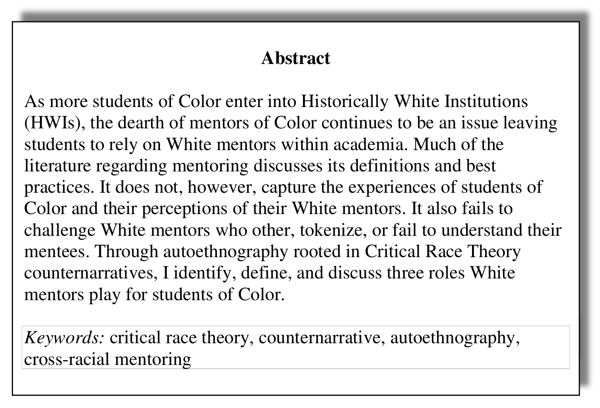

<!--slide-->

## Use (Visual) Analytics to debunk misinformation

<li><a href="https://montrealgazette.com/news/local-news/mcgill-professor-says-systemic-racism-exists-at-university" add_date="1608008840" last_modified="1608008844" icon_uri="https://dcs-static.prod.postmedia.digital/4.5.4/websites/images/apple-touch-icons/iphone-retina/icon-mg.png" >Is there systemic racism at McGill? 'Of course,' says one of only 10 Black professors | Montreal Gazette</a></li>
<li><a href="https://en.wikipedia.org/wiki/Philip_Carl_Salzman" add_date="1608008998" last_modified="1608009002" icon_uri="https://en.wikipedia.org/static/apple-touch/wikipedia.png" >Philip Carl Salzman - Wikipedia</a></li>
<li><a href="https://en.wikipedia.org/wiki/Woke" add_date="1608009568" last_modified="1608009571" icon_uri="https://en.wikipedia.org/static/apple-touch/wikipedia.png" >Woke - Wikipedia</a></li>
<li><a href="https://www.isranet.org/cijr/do-jews-have-white-privilege-january-1st2020/" add_date="1608009713" last_modified="1608009717" icon_uri="https://www.isranet.org/apple-touch-icon.png" >Do Jews Have White Privilege? – By: Philip Carl Salzman (January 1st,2020) – CIJR</a></li>
<li><a href="https://pjmedia.com/columns/philip-carl-salzman/2020/05/31/who-kills-african-americans-n472072" add_date="1608010428" last_modified="1608010433" icon_uri="https://pjmedia.com/apple-touch-icon.png" >Who Kills African Americans?</a></li>
<li><a href="https://en.wikipedia.org/wiki/PJ_Media" add_date="1608010590" last_modified="1608010593" icon_uri="https://en.wikipedia.org/static/apple-touch/wikipedia.png" >PJ Media - Wikipedia</a></li>
<li><a href="https://www.mindingthecampus.org/2019/04/29/the-war-against-white-people/" add_date="1608012599" last_modified="1608012602">The War Against White People - Minding The Campus</a></li>
<li><a href="https://www.nas.org/blogs/article/open-letter-mcgill-must-defend-prof-salzman-and-academic-freedom" add_date="1608014533" last_modified="1608014536" icon_uri="https://www.nas.org/themes/nas/assets/images/logo.svg" >Open Letter: McGill Must Defend Prof. Salzman and Academic Freedom by National Association of Scholars | NAS</a></li>
<li><a href="https://www.ledevoir.com/opinion/idees/592270/diversite-ou-discrimination-le-cas-universel-de-mcgill" add_date="1608855515" last_modified="1608855519">​Diversité ou discrimination? le cas universel de McGill | Le Devoir</a></li>

<!--slide-->

## EDI? Collectors, Nightlights, and Allies

Martinez-Cola, Marisela. “Collectors, Nightlights, and Allies, Oh My! White Mentors in the Academy.” Understanding & Dismantling Privilege, no. 1 (2020): 22.

<!--slide-->

## Guidelines: check your data source

<!--slide-->

## Saudi Arabia NYC article about gender in mentoring

<!--slide-->

## Timnit Gebru Google

<li><a href="https://www.technologyreview.com/2020/12/04/1013294/google-ai-ethics-research-paper-forced-out-timnit-gebru/" add_date="1607980311" last_modified="1607980328">We read the paper that forced Timnit Gebru out of Google. Here’s what it says. | MIT Technology Review</a></li>

<!--slide-->

## W.E.B. Du Bois (1868-1963)

W. E. B. Du Bois in 1918
(<a href="https://en.wikipedia.org/wiki/File:WEB_DuBois_1918.jpg">wikipedia</a>)

Bust of W. E. B. Du Bois at Clark Atlanta University, 2013
(<a href="https://en.wikipedia.org/wiki/File:WEB_DuBois_bust_at_Clark_Atlanta_University.jpg">wikipedia</a>)

Note:

- William Edward Burghardt Du Bois
- en 1895, il devint le premier afro-américain à obtenir un doctorat en philosophie de l'université Harvard https://fr.wikipedia.org/wiki/W._E._B._Du_Bois
- in 1895 he was the first African American to earn a Ph.D. from Harvard University https://en.wikipedia.org/wiki/W._E._B._Du_Bois

<!--slide-->

## W.E.B. Du Bois: Exposition Universelle (1900)

 <!-- Paris World Fair -->

  <!-- data-file="images/3rdparty/thinglink/1119380866397634562.html"  -->

via W.E.B. Du Bois’ Visionary Infographics Come Together for the First Time in Full Color By Jackie Mansky
Smithsonian Magazine, 2018
https://www.smithsonianmag.com/history/first-time-together-and-color-book-displays-web-du-bois-visionary-infographics-180970826/

Note:
* "Britt Rusert, associate professor in the W. E. B. Du Bois Department of Afro-American Studies at the University of Massachusetts, Amherst."
* "Rusert and Whitney Battle-Baptiste, associate professor of anthropology at U-Mass and director of its W.E.B. Du Bois Center, are the editors of a newly published book, W.E.B. Du Bois’s Data Portraits: Visualizing Black America."
- https://www.thinglink.com/card/1119380866397634562
* Lamin Fofana - I Ran From It And Was Still In It
https://laminfofana.bandcamp.com/album/darkwater
https://www.youtube.com/watch?v=b59cGbfk6U0

<!--slide-->

## #BlackHistoryMonth

<!--slide-->

## Black History Month DataViz Contest / Observable 

<li><a href="https://observablehq.com/@observablehq/black-history-month-dataviz-contest" add_date="1612898351" last_modified="1612898360" icon_uri="https://static.observablehq.com/favicon-512.0667824687f99c942a02e06e2db1a060911da0bf3606671676a255b1cf97b4fe.png" >Black History Month DataViz Contest / Observable / Observable</a></li>
<li><a href="https://observablehq.com/collection/@observablehq/equality" add_date="1612898411" last_modified="1612898411" icon_uri="https://static.observablehq.com/favicon-512.0667824687f99c942a02e06e2db1a060911da0bf3606671676a255b1cf97b4fe.png" >Equality / Observable / Observable</a></li>

<!--slide-->

## Black Innovators in STEM Who Changed the World

<li><a href="https://www.osc.org/black-innovators-in-stem-who-changed-the-world/" add_date="1612999227" last_modified="1612999236" icon_uri="https://www.osc.org/wp-content/uploads/2020/06/cropped-osc-favicon-1-192x192.png" >Black Innovators in STEM Who Changed the World</a></li>

<!--section-->

## Unsorted

<!--slide-->

## Accessibility in Canada

https://github.com/wet-boew/wet-boew

<!--slide-->

## Bookmarks

<ul>
<!-- <li><a href="https://www.ryerson.ca/diversity-self-id/diversity-data-visualization/" add_date="1607708131" last_modified="1607708135">Diversity Data Visualization - Diversity Self-ID - Ryerson University</a></li> -->
<li><a href="https://www.informationisbeautiful.net/visualizations/diversity-in-tech/" add_date="1607709604" last_modified="1607709607" icon_uri="https://informationisbeautiful.net/apple-touch-icon.png" >Diversity in Tech — Information is Beautiful</a></li>
<li><a href="https://www.datawrapper.de/_/VQEvf/" add_date="1607980379" last_modified="1607980382">Common carbon footprint benchmarks | Created with Datawrapper</a></li>

<li><a href="https://en.wikipedia.org/wiki/White_privilege" add_date="1608013089" last_modified="1608013092" icon_uri="https://en.wikipedia.org/static/apple-touch/wikipedia.png" >White privilege - Wikipedia</a></li>
<li><a href="https://en.wikipedia.org/wiki/White_Privilege:_Unpacking_the_Invisible_Knapsack" add_date="1608013297" last_modified="1608013301" icon_uri="https://en.wikipedia.org/static/apple-touch/wikipedia.png" >White Privilege: Unpacking the Invisible Knapsack - Wikipedia</a></li>

<li><a href="https://www.ledevoir.com/politique/quebec/591688/rapport-du-groupe-d-action-contre-le-racisme" add_date="1608008151" last_modified="1608008156">Rapport du Groupe d'action contre le racisme: Québec désignera un ministre responsable de la Lutte contre le racisme | Le Devoir</a></li>
<li><a href="https://www.ontario.ca/page/ops-inclusion-diversity-blueprint" add_date="1608664604" last_modified="1608664617" icon_uri="https://www.ontario.ca/img/favicon.ico" >OPS Inclusion &amp; Diversity Blueprint | Ontario.ca</a></li>

<li><a href="https://www.sarahroubato.com/po/joyce/" add_date="1609693259" last_modified="1609693263">Lettre à Joyce, morte sous les insultes de ses infirmières. - Sarah Roubato</a></li>

<li><a href="https://www.nytimes.com/2021/02/09/world/europe/france-threat-american-universities.html" add_date="1612988019" last_modified="1612988029" icon_uri="https://www.nytimes.com/vi-assets/static-assets/apple-touch-icon-28865b72953380a40aa43318108876cb.png" >'Woke' American Ideas Are a Threat, French Leaders Say - The New York Times</a></li>

<li><a href="https://app.milanote.com/1Kxgc81Lmfvj68?p=LaActZkx6LI" add_date="1613177358" last_modified="1613177364" icon_uri="https://app.milanote.com/img/milanote-touch-icon-180.png" >How to Predict Culture in 2050? - Milanote</a></li>

<li><a href="https://app.milanote.com/1Kcm161nPZw8bN?p=1hMTODd4wNt" add_date="1613177369" last_modified="1613177369" icon_uri="https://app.milanote.com/img/milanote-touch-icon-180.png" >Design and Visualization Fall 2020 - Milanote</a></li>

<li><a href="https://www.onf.ca/chaines/communautes-noires-canada/?utm_campaign=programming&amp;utm_source=facebookfr&amp;utm_medium=social-media&amp;utm_content=channel" add_date="1613924796" last_modified="1613924803" icon_uri="https://dkyhanv6paotz.cloudfront.net/static/apple-touch-icon.6c146b0e6784.png" >Communautés noires du Canada - ONF</a></li>

<li><a href="https://www.polymtl.ca/programmes/cours/visualisation-de-donnees" add_date="1614030850" last_modified="1614030875" icon_uri="https://www.polymtl.ca/programmes/profiles/portail/themes/custom/theme_polytechnique/favicon.ico" >Visualisation de données | Programmes d'études</a></li>

<li><a href="https://github.com/ChristianFrisson/reveal-a11y" add_date="1614037427" last_modified="1614037427" icon_uri="https://github.githubassets.com/favicons/favicon.svg" >ChristianFrisson/reveal-a11y: Reveal.js plugin for better slide accessibility</a></li>

<li><a href="https://www.eventbrite.ca/e/ipprenticeship-career-fair-for-emerging-black-professionals-and-students-tickets-138964780399" add_date="1614116430" last_modified="1614116434" icon_uri="https://cdn.evbstatic.com/s3-build/perm_001/477279/django/images/favicons/favicon-194x194.png" >ipprenticeship: Career Fair for Emerging Black Professionals and Students Tickets, Thu, 25 Feb 2021 at 1:00 PM | Eventbrite</a></li>

<li><a href="https://www.ledevoir.com/opinion/chroniques/595780/les-profs-la-censure-et-la-pandemie" add_date="1614143334" last_modified="1614143338">Les profs, la censure et la pandémie | Le Devoir</a></li>

<li><a href="https://histoireantiracisteuottawa.ca/" add_date="1614143490" last_modified="1614143490">Histoire antiraciste | uOttawa | Antiracist History | intégrer une approche antiraciste à notre enseignement, notre recherche &amp; notre service | to integrate antiracism into our teaching, research &amp; service</a></li>
</ul>

<!--slide-->

## Féminisme des Données: 7 principes

1. Examine power
2. Challenge power
3. Elevate emotion and embodiment
4. Rethink binaries and hierarchies
5. Embrace pluralism
6. Consider context
7. Make labor visible

Catherine D’Ignazio and Lauren F. Klein. “Introduction: Why Data Science Needs Feminism.” In Data Feminism. The MIT Press, 2020. https://data-feminism.mitpress.mit.edu/pub/frfa9szd/

Note:

1. Examine power. Data feminism begins by analyzing how power operates in the world.
2. Challenge power. Data feminism commits to challenging unequal power structures and working toward justice.
3. Elevate emotion and embodiment. Data feminism teaches us to value multiple forms of knowledge, including the knowledge that comes from people as living, feeling bodies in the world.
4. Rethink binaries and hierarchies. Data feminism requires us to challenge the gender binary, along with other systems of counting and classification that perpetuate oppression.
5. Embrace pluralism. Data feminism insists that the most complete knowledge comes from synthesizing multiple perspectives, with priority given to local, Indigenous, and experiential ways of knowing.
6. Consider context. Data feminism asserts that data are not neutral or objective. They are the products of unequal social relations, and this context is essential for conducting accurate, ethical analysis.
7. Make labor visible. The work of data science, like all work in the world, is the work of many hands. Data feminism makes this labor visible so that it can be recognized and valued.
