<!-- Use these links to change the theme at runtime: -->
<!-- TODO: style this as menu component or make sure it is ignored for deployment -->
<!-- 

<a href="#" onclick="document.getElementById('theme').setAttribute('href','css/theme/black.css'); return false;">black</a>
<a href="#" onclick="document.getElementById('theme').setAttribute('href','css/theme/white.css'); return false;">white</a>
<a href="#" onclick="document.getElementById('theme').setAttribute('href','css/theme/league.css'); return false;">league</a>
<a href="#" onclick="document.getElementById('theme').setAttribute('href','css/theme/sky.css'); return false;">sky</a>
<a href="#" onclick="document.getElementById('theme').setAttribute('href','css/theme/beige.css'); return false;">beige</a>
<a href="#" onclick="document.getElementById('theme').setAttribute('href','css/theme/simple.css'); return false;">simple</a>
<a href="#" onclick="document.getElementById('theme').setAttribute('href','css/theme/serif.css'); return false;">serif</a>
<a href="#" onclick="document.getElementById('theme').setAttribute('href','css/theme/blood.css'); return false;">blood</a>
<a href="#" onclick="document.getElementById('theme').setAttribute('href','css/theme/night.css'); return false;">night</a>
<a href="#" onclick="document.getElementById('theme').setAttribute('href','css/theme/moon.css'); return false;">moon</a>
<a href="#" onclick="document.getElementById('theme').setAttribute('href','css/theme/solarized.css'); return false;">solarized</a>

 -->

<!-- Use this to add a background image: -->
<!-- .slide: id="start" class="cover" data-background="images/projects/InfoPhys.jpg" data-state="start"-->

<!-- Use this transparent styling in case of a background image: -->
<!-- 
 -->

<!-- ## InfoVis ↔ EDI -->

## Visualisation d'information

## ↔

## Equité, diversité et inclusion

<!-- 
  -->

<a href="https://frisson.re" title="Christian Frisson's Website">Christian Frisson</a>

### PolyMTL INF8808

#### 2021-02-25

Notes:

- Bonjour, Hi. Je m'appelle Christian Frisson.

<!--slide-->

## McGill [IDMIL](http://www-new.idmil.org/)

Notes:

- Je suis chercheur postdoctoral et bientôt chercheur invité à l'Université McGill, à l'IDMIL (Input Devices and Music Interaction Lab).
- Parmi les domaines de recherche d'IDMIL, dans la capture d'écran, de gauche à droite:
   1. la conception d'instruments de musique numérique
   2. le contrôle gestuel de la performance musicale
   3. l'interaction humain-machine dont la visualisation d'information
   4. la collection et l'analyse de données de mouvements 

<!--slide-->

## McGill [IDMIL](http://www-new.idmil.org/)

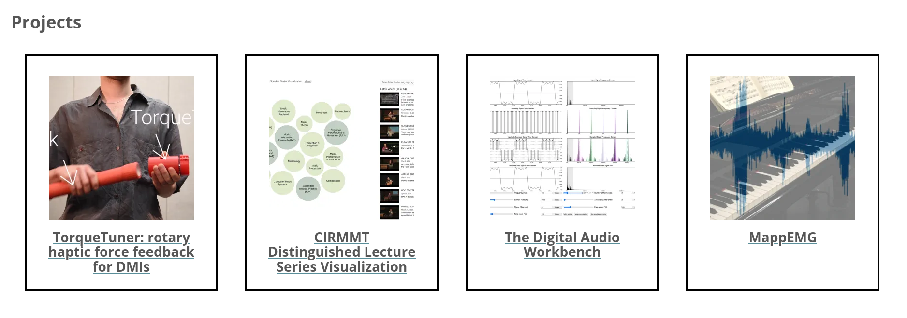

Notes:

- Mes projets de recherche récents à IDMIL s'inscrivent dans 3 domaines de recherche:
   1. haptique avec retour de force (projet 1 à gauche: module de couple moteur embarqué pour instrument de musique numérique) et vibrotactile (projet 4 à droite: mappage de tension musicale de performances musicales vers ressenti vibrotactile pour l'audience)
   2. visualisation d'information (projet 2: explorateur de conférences distinguées CIRMMT)
   3. supports de cours interactifs (projet 3: établi explorable de traitement de signal audionumérique)

<!--slide-->

## [Portfolio](https://frisson.re)

Notes:
- Je vous invite à consulter mon portfolio en ligne.

<!--slide-->

<!-- ## InfoVis ↔ EDI -->

<!-- Use this to add a background image: -->
<!-- .slide: class="cover" data-background="images/projects/InfoPhys.jpg" -->

## Visualisation d'information

## &harr;

## Equité, diversité et inclusion

Notes:

- Aujourd'hui je vais vous parler de Visualisation d'information, et d'Équité, diversité et inclusion.
- J'ai choisi cette image de fond parce qu'à la fois elle illustre un problème et suggère quelques pistes.
- Le problème, c'est qu'il y a un manque d'équité, de diversité et d'inclusion en visualisation d'information, comme dans beaucoup d'autres domaines dans le monde. Ce problème est largement imposé par les hommes blancs, comme moi. C'est ma main dans l'image de fond.

<!--slide-->

<!-- ## InfoVis ↔ EDI -->

<!-- Use this to add a background image: -->
<!-- .slide: class="cover"  data-background="images/projects/InfoPhys.jpg" -->

## InfoVis

## &harr;

## EDI

Notes:

- Pour raccourcir: InfoVis et EDI.

<!--slide-->

<!-- ## InfoVis ↔ EDI -->

## Sommaire

### EDI?

### EDI &rarr; InfoVis

### InfoVis &rarr; EDI

Notes:

- Pourquoi raccourcir? Parce que c'est plus sommaire, et ça m'aide à vous expliquer le sommaire de ma présentation:
- Je vais d'abord vous introduire les problèmes d'Équité, de Diversité et d'Inclusion.
- La majeure partie de la présentation portera sur comment intégrer Équité, Diversité et Inclusion en Visualisation d'Information.
- Enfin je concluerai sur comment la Visualisation d'Information peut aider à améliorer l'Équité, la Diversité et l'Inclusion.

<!--section-->

## Sommaire

## EDI?

### EDI &rarr; InfoVis

### InfoVis &rarr; EDI

Notes:
- Commençons donc par l'introduction sur les problèmes d'Équité, de Diversité et d'Inclusion.

<!--slide-->

## EDI: Problèmes

Reworked from Figure 2.2: The anatomy of oppression,  from: Metoyer, Ronald, and Kelly Gaither. Diversity in Visualization. Vol. 6. Synthesis Lectures on Visualization. Morgan & Claypool, 2019. https://www.morganclaypool.com/doi/10.2200/S00894ED1V01Y201901VIS010

Notes:
- Les problèmes d'Équité, de Diversité et d'Inclusion commencent quand une partie de la population, majoritaire ou minoritaire, a des préjudices sur une autre partie de la population, majoritaire ou minoritaire, à cause de différences d'éthnies (de race), de genres, de classes sociales et de capacités (ou handicaps). 
- Quand une partie de la population qui a ces préjudices est en possession de pouvoir, résultent des oppressions et discriminations: du racisme, du sexisme, du classisme, et du capacitisme.

<!--slide-->

## EDI: Illustrations

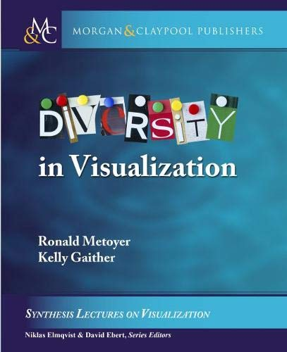

Metoyer, Ronald, and Kelly Gaither. Diversity in Visualization. Vol. 6. Synthesis Lectures on Visualization. Morgan & Claypool, 2019. https://www.morganclaypool.com/doi/10.2200/S00894ED1V01Y201901VIS010

Notes:
- L'illustration dans la diapositive précédente est tirée de cet ouvrage, Diversity in Visualisation.
- A la conférence VIS en 2016, un panel d'expert.e.s de la communauté SciVis (une commumauté parmi les 3 de la conférence VIS, avec InfoVis et VAST) s'est réuni pour discuter pourquoi la composante SciVis a dimininué significativement pendant la décénie. Pendant la session de questions, Annie Preston, doctorante à l'Université de Californie, Davis, a demandé si les panelistes pensaient que le manque de diversité était un facteur de cette diminution. (traduit du résumé anglais du livre)
- "At the 2016 IEEE VIS Conference in Baltimore, Maryland, a panel of experts from the Scientific Visualization (SciVis) community gathered to discuss why the SciVis component of the conference had been shrinking significantly for over a decade. As the panelists concluded and opened the session to questions from the audience, Annie Preston, a Ph.D. student at the University of California, Davis, asked whether the panelists thought diversity or, more specifically, the lack of diversity was a factor." (from book abstract).
- Au cours de cette présentation, je vais ré-employer des illustrations de ce livre...

<!--slide-->

## EDI: Illustrations

Catherine D’Ignazio and Lauren F. Klein. Data Feminism. The MIT Press, 2020. https://data-feminism.mitpress.mit.edu/

Notes:
- ... et de cet ouvrage: Data Feninism, par Catherine D’Ignazio and Lauren F. Klein, aux éditions MIT Press, très actuel, de 2020.
- Une particularité de ce livre est qu'il est en accès/consultation libre sur PubPub, une plateforme où ce livre a au préalable été révisé des pairs.

<!--slide-->

## EDI: Pouvoir dans le monde

Catherine D’Ignazio and Lauren F. Klein. “1. The Power Chapter.” In Data Feminism. The MIT Press, 2020. https://data-feminism.mitpress.mit.edu/pub/vi8obxh7

Notes:
- Le premier chapitre de ce livre Data Feminism invite à éxaminer comment le pouvoir opère dans le monde.  

<!--slide-->

## EDI: Pouvoir dans le monde

Catherine D’Ignazio and Lauren F. Klein. “1. The Power Chapter.” In Data Feminism. The MIT Press, 2020. https://data-feminism.mitpress.mit.edu/pub/vi8obxh7

Notes:
- Voici une illustration de ce premier chapitre du livre. C'est un graphique qui montre l'évolution de la proportion hommes-femmes qui ont obtenu un diplôme de premier cycle en génie informatique et logiciel aux États Unis, de 1970 à 2010. On constate qu'il y a une proportion écasante d'hommes, d'où le titre: le génie informatique et logiciel, la fabrique masculine.

<!--slide-->

## EDI: Pouvoir dans le monde

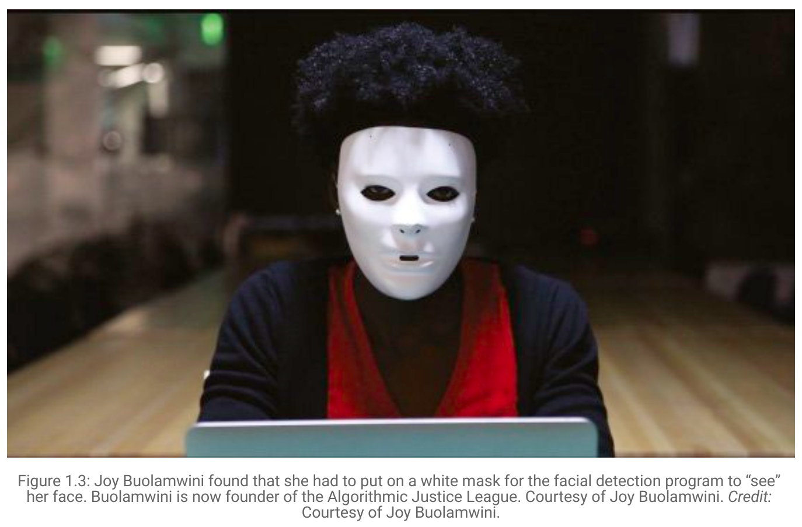

Catherine D’Ignazio and Lauren F. Klein. “1. The Power Chapter.” In Data Feminism. The MIT Press, 2020. https://data-feminism.mitpress.mit.edu/pub/vi8obxh7

Notes:
- Voici une illustration de ce premier chapitre du livre. On voit Joy Buolamwini, une activiste de l'Algorithmic Justice League, qui a constaté qu'elle a dû porter ce masque blanc pour qu'une application de reconnaissance faciale puisse "voir" son visage. Ces algorithmes d'intelligence artificielle ont des biais introduits par leurs développeurs dont une majorité est des hommes blancs. 

<!--slide-->

## EDI: Problèmes

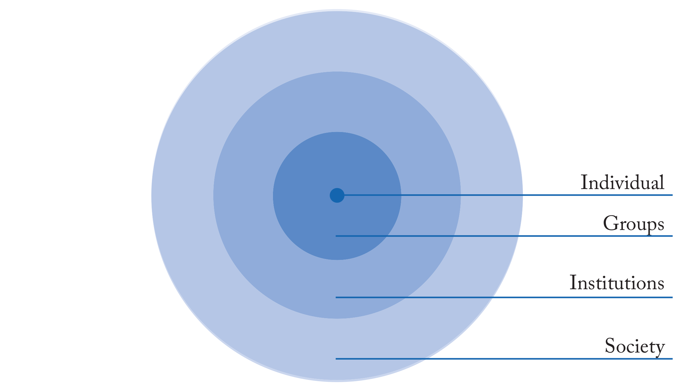

Figure 2.1: The individual exists within a larger social structure.,  from: Metoyer, Ronald, and Kelly Gaither. Diversity in Visualization. Vol. 6. Synthesis Lectures on Visualization. Morgan & Claypool, 2019. https://www.morganclaypool.com/doi/10.2200/S00894ED1V01Y201901VIS010

Notes:
- Voici une autre figure du livre Diversity in Visualization qui illustre les problèmes d'Équité, de Diversité et d'Inclusion. Des individus peuvent devenir la cible d'agressions par d'autres en fonction de préjudices dont je vous ai parlé précédemment. Ces agressions et problèmes deviennent systémiques quand ils s'étendent à des groupes, des institutions, et quand ils s'ancrent dans la sociétés, réservant des privilèges aux agresseurs.

<!--slide-->

## EDI: Canada

<!-- ### NSERC CRSNG -->

https://www.nserc-crsng.gc.ca/NSERC-CRSNG/EDI-EDI/index_fra.asp

<!--

 -->

Notes:
- Les trois organismes de la recherche au Canada ont compilé cet énoncé sur l’équité, la diversité et l’inclusion (EDI).
- "Le Conseil de recherches en sciences humaines du Canada, le Conseil de recherches en sciences naturelles et en génie du Canada et les Instituts de recherche en santé du Canada sont déterminés à appuyer l’excellence en recherche et la formation des chercheurs et des chercheuses d’aujourd’hui et de demain. La création d’un milieu de la recherche équitable, diversifié et inclusif au Canada est essentielle à la conduite de travaux de recherche inédits, de qualité exceptionnelle et susceptibles de générer des retombées, qui permettent d’approfondir les connaissances et de résoudre des problèmes locaux, nationaux et mondiaux.
- Dans cet esprit, les organismes entendent :
   - aider à assurer l’accès équitable aux possibilités de financement pour tous les chercheurs et toutes les chercheuses, y compris les étudiants, les étudiantes et les stagiaires postdoctoraux;
   - favoriser l’intégration des principes d’équité, de diversité et d’inclusion dans la conception du programme de recherche et dans les pratiques;
   - accroitre la participation équitable et inclusive dans le milieu de la recherche, y compris au sein des équipes de recherche;
   - recueillir les données et procéder aux analyses nécessaires pour assurer la considération des questions d’équité, de diversité et d’inclusion dans la prise de décisions.
- Pour ce faire, les organismes travailleront avec tous ceux et celles œuvrant dans le milieu de la recherche afin de créer la culture d’inclusion qui est nécessaire à l’atteinte de l’excellence en recherche et à l’obtention de résultats probants, pertinents et accessibles à diverses populations."

<!--slide-->

## EDI: PolyMTL

https://www.polymtl.ca/edi/

Notes:
- Votre institution, Polytechnique Montréal, "est activement engagée à promouvoir la diversité, l’équité et l’inclusion à travers toute sa communauté.".

<!--slide-->

## In Memoriam

Plaque apposée sur le mur extérieur de l'École polytechnique à la mémoire des 14 victimes tuées. 
https://fr.wikipedia.org/wiki/Tuerie_de_l%27%C3%89cole_polytechnique_de_Montr%C3%A9al 
(<a href="https://commons.wikimedia.org/wiki/File:Mtl_dec6_plaque.jpg?uselang=fr">wikipedia</a>)

Notes:
- Je suis honoré d'avoir été invité à vous parler d'équité, de diversité, et d'inclusion à l'École polytechnique de Montréal. En 1989, un homme blanc aux préjudices sexistes a tué 14 femmes. 

<!--section-->

## Sommaire

### EDI?

## EDI &rarr; InfoVis

### InfoVis &rarr; EDI

Notes:
- Passons maintenant à la majeure partie de la présentation: comment intégrer Équité, Diversité et Inclusion en Visualisation d'Information.

<!--section-->

## Internationalisation &amp; InfoVis

### Révisions d'une visualisation

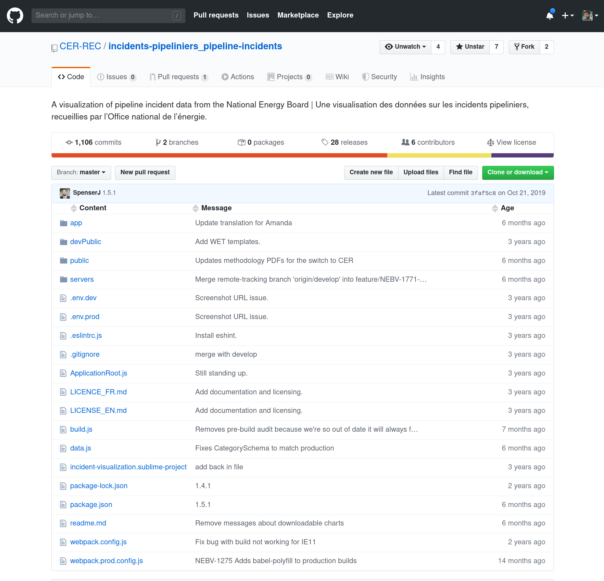

<!-- https://github.com/CER-REC/incidents-pipeliniers_pipeline-incidents -->

Notes:
- Je vais commencer par un cas d'étude sur l'internationalisation, qui je pense vous/nous touche à Montréal, où on peut trouver des quartier où on parle uniquement français, d'autres uniquement anglais, etc... et ça peut poser des problèmes d'inclusion dans la vie de tous les jours, même si ce sont 2 langues officielles au Canada. 
- Ici vous voyez la page du projet github de la visualisation d'information du jeu de données sur les incidents pipeliniers de la Régie de l'Énergie du Canada. Ce projet à été réalisé par plusieurs équipes à Calgary, ville majoritairement anglophone.

<!--slide-->

## Internationalisation &amp; InfoVis

### Visualisation de révisions

 <video width="100%" height="auto" controls>
  <source src="images/projects/PipelineIncidentsRevisionsPreviews-yuv420p-2020-04-06-22-07.mp4" type="video/mp4">
Your browser does not support the video tag.
</video>

Notes: 
- Voici une vidéo qui résume l'évolution de 3 ans de travail de développement, dont 1106 versions, en 53 s. 
- J'ai développé un script pour extraire toutes les révisions de cette visualisation. 
- Pour chaque révision, le script installe les dépendances, lance le serveur web, et extrait une capture d'écran avec un navigateur sans tête.
- Je vais jouer la vidéo.
- C'est fascinant de voir comment la visualisation se contruit dès le début.

<!--slide-->

## Quizz

### Quelles révisions significatives observez-vous dans la video?

 <video width="100%" height="auto" controls>
  <source src="images/projects/PipelineIncidentsRevisionsPreviews-yuv420p-2020-04-06-22-07.mp4" type="video/mp4">
Your browser does not support the video tag.
</video>

Notes:
- Je vous propose un quizz: je vais vous demander de faire jouer vos capacités visuelles analytiques, que vous avez aiguisées en étudiant la visualisation d'information. Je vous mets au défi: quelles révisions significatives observez-vous dans la video?
- Je vais vous rejouer la vidéo.
- On constate:
   - que la traduction française est arrivée bien plus tard.
   - (et que ce groupe gouvernemental vient de changer de nom, d'Office vers Régie.)

<!--section-->

## Genres &amp; InfoVis

Walny, Jagoda, Christian Frisson, Mieka West, Doris Kosminsky, Søren Knudsen, Sheelagh Carpendale, and Wesley Willett. “<a href="https://doi.org/10.1109/TVCG.2019.2934538">Data Changes Everything: Challenges and Opportunities in Data Visualization Design Handoff.</a>” IEEE Transactions on Visualization and Computer Graphics, TVCG’20, 26, no. 1 (January 2020): 12–22 (<a href="https://vimeo.com/368703151">video</a>)

Notes:
- Je vais maintenant vous expliquer un des problèmes en EDI par l'introduction d'une présentation d'un article dont je suis co-auteur. 
- Jagoda Walny a conçu ces diapositives en anglais et les à présentées à la conférence IEEE VIS 2019 à Vancouver où nous avons reçu le prix du meilleur article catégorie InfoVis.

<!--slide-->

## Genres &amp; InfoVis

Walny, Jagoda, Christian Frisson, Mieka West, Doris Kosminsky, Søren Knudsen, Sheelagh Carpendale, and Wesley Willett. “<a href="https://doi.org/10.1109/TVCG.2019.2934538">Data Changes Everything: Challenges and Opportunities in Data Visualization Design Handoff.</a>” IEEE Transactions on Visualization and Computer Graphics, TVCG’20, 26, no. 1 (January 2020): 12–22 (<a href="https://vimeo.com/368703151">video</a>)

Notes:
- J’ai traduit ces diapositives en français pour vous.

<!--slide-->

## Genres &amp; InfoVis: Taylor

Walny, Jagoda, Christian Frisson, Mieka West, Doris Kosminsky, Søren Knudsen, Sheelagh Carpendale, and Wesley Willett. “<a href="https://doi.org/10.1109/TVCG.2019.2934538">Data Changes Everything: Challenges and Opportunities in Data Visualization Design Handoff.</a>” IEEE Transactions on Visualization and Computer Graphics, TVCG’20, 26, no. 1 (January 2020): 12–22 (<a href="https://vimeo.com/368703151">video</a>)

Notes:
- Voici Taylor.
- Taylor est conceptrice et développeuse généraliste (full-stack) de visualisations: une ninja de la visualisation, si vous préférez. Donnez lui un jeu de données et elle fera tout ce que vous avez besoin pour le transformer en une visualisation élégante, lisible et interactive.
- Elle va [CLIC]

<!--slide-->

## Genres &amp; InfoVis: Taylor

Walny, Jagoda, Christian Frisson, Mieka West, Doris Kosminsky, Søren Knudsen, Sheelagh Carpendale, and Wesley Willett. “<a href="https://doi.org/10.1109/TVCG.2019.2934538">Data Changes Everything: Challenges and Opportunities in Data Visualization Design Handoff.</a>” IEEE Transactions on Visualization and Computer Graphics, TVCG’20, 26, no. 1 (January 2020): 12–22 (<a href="https://vimeo.com/368703151">video</a>)

Notes:
- préparer les données, [CLIC]

<!--slide-->

## Genres &amp; InfoVis: Taylor

Walny, Jagoda, Christian Frisson, Mieka West, Doris Kosminsky, Søren Knudsen, Sheelagh Carpendale, and Wesley Willett. “<a href="https://doi.org/10.1109/TVCG.2019.2934538">Data Changes Everything: Challenges and Opportunities in Data Visualization Design Handoff.</a>” IEEE Transactions on Visualization and Computer Graphics, TVCG’20, 26, no. 1 (January 2020): 12–22 (<a href="https://vimeo.com/368703151">video</a>)

Notes:
- générer une variété de prototypes inventifs, [CLIC]

<!--slide-->

## Genres &amp; InfoVis: Taylor

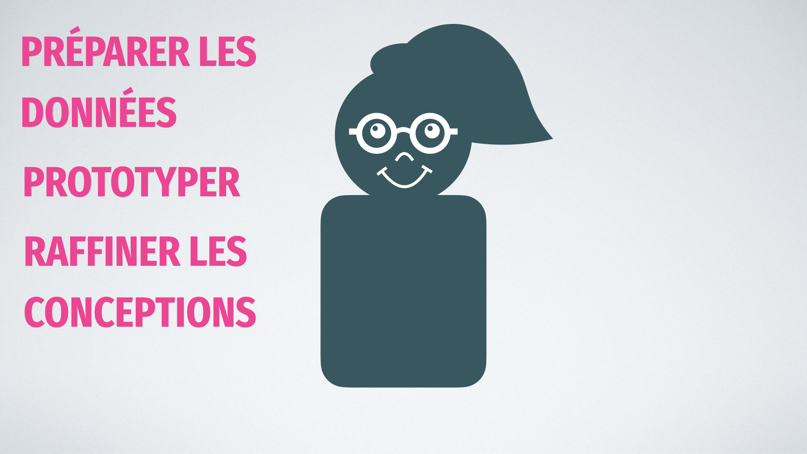

Walny, Jagoda, Christian Frisson, Mieka West, Doris Kosminsky, Søren Knudsen, Sheelagh Carpendale, and Wesley Willett. “<a href="https://doi.org/10.1109/TVCG.2019.2934538">Data Changes Everything: Challenges and Opportunities in Data Visualization Design Handoff.</a>” IEEE Transactions on Visualization and Computer Graphics, TVCG’20, 26, no. 1 (January 2020): 12–22 (<a href="https://vimeo.com/368703151">video</a>)

Notes:
- ajuster la mise en correspondance des données et des conceptions, et [CLIC]

<!--slide-->

## Genres &amp; InfoVis: Taylor

Walny, Jagoda, Christian Frisson, Mieka West, Doris Kosminsky, Søren Knudsen, Sheelagh Carpendale, and Wesley Willett. “<a href="https://doi.org/10.1109/TVCG.2019.2934538">Data Changes Everything: Challenges and Opportunities in Data Visualization Design Handoff.</a>” IEEE Transactions on Visualization and Computer Graphics, TVCG’20, 26, no. 1 (January 2020): 12–22 (<a href="https://vimeo.com/368703151">video</a>)

Notes:
- vous présenter une nouvelle manière de regarder vos données.
- Ou, au moins, c’est ainsi que Taylor travaillait il y a peut-être 10 ans.

<!--slide-->

## Genres &amp; InfoVis: Taylor

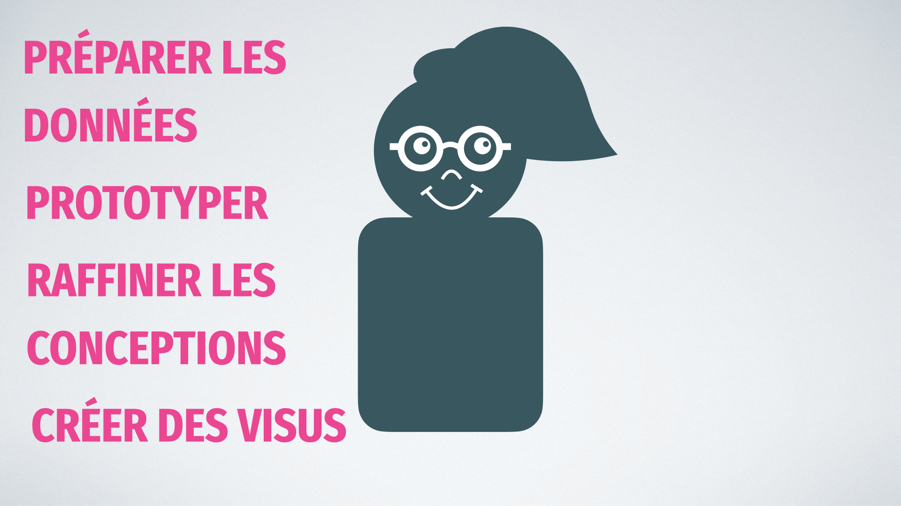

Walny, Jagoda, Christian Frisson, Mieka West, Doris Kosminsky, Søren Knudsen, Sheelagh Carpendale, and Wesley Willett. “<a href="https://doi.org/10.1109/TVCG.2019.2934538">Data Changes Everything: Challenges and Opportunities in Data Visualization Design Handoff.</a>” IEEE Transactions on Visualization and Computer Graphics, TVCG’20, 26, no. 1 (January 2020): 12–22 (<a href="https://vimeo.com/368703151">video</a>)

Notes:
- Aujourd’hui, Taylor est censée connaître l’état de l’art en [CLIC]

<!--slide-->

## Genres &amp; InfoVis: Taylor

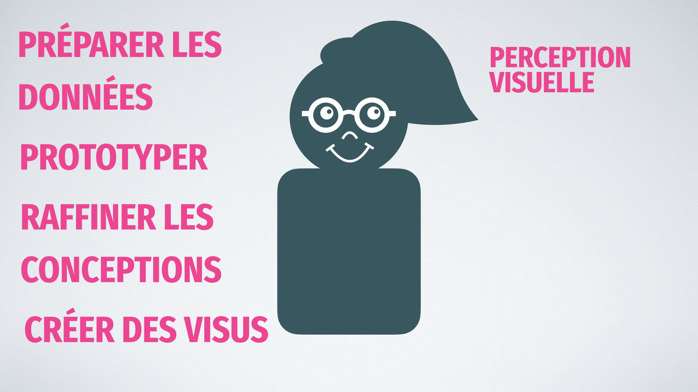

Walny, Jagoda, Christian Frisson, Mieka West, Doris Kosminsky, Søren Knudsen, Sheelagh Carpendale, and Wesley Willett. “<a href="https://doi.org/10.1109/TVCG.2019.2934538">Data Changes Everything: Challenges and Opportunities in Data Visualization Design Handoff.</a>” IEEE Transactions on Visualization and Computer Graphics, TVCG’20, 26, no. 1 (January 2020): 12–22 (<a href="https://vimeo.com/368703151">video</a>)

Notes:
- perception visuelle - évidemment -, [CLIC]

<!--slide-->

## Genres &amp; InfoVis: Taylor

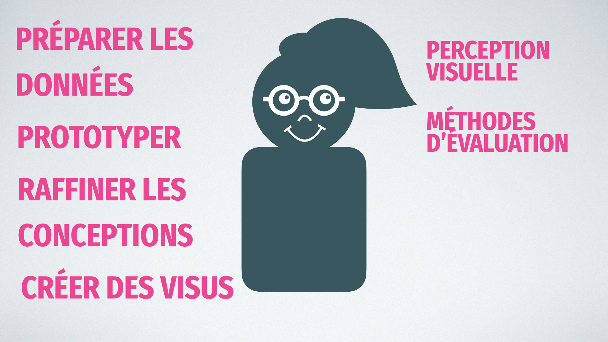

Walny, Jagoda, Christian Frisson, Mieka West, Doris Kosminsky, Søren Knudsen, Sheelagh Carpendale, and Wesley Willett. “<a href="https://doi.org/10.1109/TVCG.2019.2934538">Data Changes Everything: Challenges and Opportunities in Data Visualization Design Handoff.</a>” IEEE Transactions on Visualization and Computer Graphics, TVCG’20, 26, no. 1 (January 2020): 12–22 (<a href="https://vimeo.com/368703151">video</a>)

Notes:
- maîtriser les méthodes d’évaluation, [CLIC]

<!--slide-->

## Genres &amp; InfoVis: Taylor

Walny, Jagoda, Christian Frisson, Mieka West, Doris Kosminsky, Søren Knudsen, Sheelagh Carpendale, and Wesley Willett. “<a href="https://doi.org/10.1109/TVCG.2019.2934538">Data Changes Everything: Challenges and Opportunities in Data Visualization Design Handoff.</a>” IEEE Transactions on Visualization and Computer Graphics, TVCG’20, 26, no. 1 (January 2020): 12–22 (<a href="https://vimeo.com/368703151">video</a>)

Notes:
- être une conceptrice centrée humain empathique. 
- [CLIC]

<!--slide-->

## Genres &amp; InfoVis: Taylor

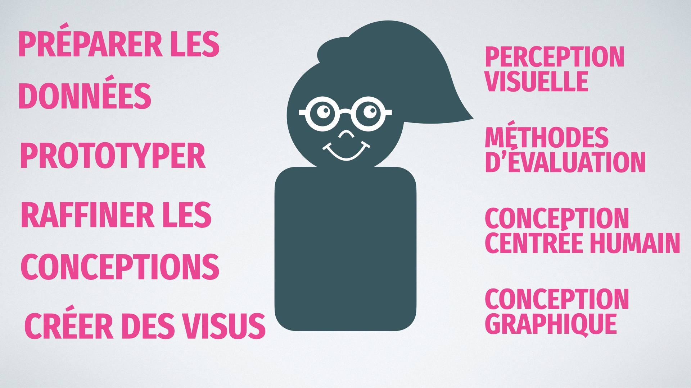

Walny, Jagoda, Christian Frisson, Mieka West, Doris Kosminsky, Søren Knudsen, Sheelagh Carpendale, and Wesley Willett. “<a href="https://doi.org/10.1109/TVCG.2019.2934538">Data Changes Everything: Challenges and Opportunities in Data Visualization Design Handoff.</a>” IEEE Transactions on Visualization and Computer Graphics, TVCG’20, 26, no. 1 (January 2020): 12–22 (<a href="https://vimeo.com/368703151">video</a>)

Notes:
- ET une conceptrice graphique [CLIC]

<!--slide-->

## Genres &amp; InfoVis: Taylor

Walny, Jagoda, Christian Frisson, Mieka West, Doris Kosminsky, Søren Knudsen, Sheelagh Carpendale, and Wesley Willett. “<a href="https://doi.org/10.1109/TVCG.2019.2934538">Data Changes Everything: Challenges and Opportunities in Data Visualization Design Handoff.</a>” IEEE Transactions on Visualization and Computer Graphics, TVCG’20, 26, no. 1 (January 2020): 12–22 (<a href="https://vimeo.com/368703151">video</a>)

Notes:
- ET aussi une magicienne de l’analytique [CLIC]

<!--slide-->

## Genres &amp; InfoVis: Taylor

Walny, Jagoda, Christian Frisson, Mieka West, Doris Kosminsky, Søren Knudsen, Sheelagh Carpendale, and Wesley Willett. “<a href="https://doi.org/10.1109/TVCG.2019.2934538">Data Changes Everything: Challenges and Opportunities in Data Visualization Design Handoff.</a>” IEEE Transactions on Visualization and Computer Graphics, TVCG’20, 26, no. 1 (January 2020): 12–22 (<a href="https://vimeo.com/368703151">video</a>)

Notes:
- (qui est EXCELLENTE en apprentissage machine),

<!--slide-->

## Genres &amp; InfoVis: Taylor

Walny, Jagoda, Christian Frisson, Mieka West, Doris Kosminsky, Søren Knudsen, Sheelagh Carpendale, and Wesley Willett. “<a href="https://doi.org/10.1109/TVCG.2019.2934538">Data Changes Everything: Challenges and Opportunities in Data Visualization Design Handoff.</a>” IEEE Transactions on Visualization and Computer Graphics, TVCG’20, 26, no. 1 (January 2020): 12–22 (<a href="https://vimeo.com/368703151">video</a>)

Notes:
- et pour couronner le tout,… qui créée des histoires de données captivantes et engageantes [CLIC]

<!--slide-->

## Genres &amp; InfoVis: Taylor

Walny, Jagoda, Christian Frisson, Mieka West, Doris Kosminsky, Søren Knudsen, Sheelagh Carpendale, and Wesley Willett. “<a href="https://doi.org/10.1109/TVCG.2019.2934538">Data Changes Everything: Challenges and Opportunities in Data Visualization Design Handoff.</a>” IEEE Transactions on Visualization and Computer Graphics, TVCG’20, 26, no. 1 (January 2020): 12–22 (<a href="https://vimeo.com/368703151">video</a>)

Notes:
- qui vont révolutionner le monde. [CLIC]

<!--slide-->

## Genres &amp; InfoVis: Taylor

Walny, Jagoda, Christian Frisson, Mieka West, Doris Kosminsky, Søren Knudsen, Sheelagh Carpendale, and Wesley Willett. “<a href="https://doi.org/10.1109/TVCG.2019.2934538">Data Changes Everything: Challenges and Opportunities in Data Visualization Design Handoff.</a>” IEEE Transactions on Visualization and Computer Graphics, TVCG’20, 26, no. 1 (January 2020): 12–22 (<a href="https://vimeo.com/368703151">video</a>)

Notes:
- [SILENCE]
- Aujourd’hui, Taylor commence à ressembler bien plus à ça [une licorne].

<!--slide-->

## Genres &amp; InfoVis: Licornes

Catherine D’Ignazio and Lauren F. Klein. “5. Unicorns, Janitors, Ninjas, Wizards, and Rock Stars.” In Data Feminism. The MIT Press, 2020. https://data-feminism.mitpress.mit.edu/pub/2wu7aft8

Notes:
- A propos de licornes, le chapitre 5 du livre Data Feminism nous en propose une définition. 

<!--slide-->

## Genres &amp; InfoVis: Scientifiques des Données

Catherine D’Ignazio and Lauren F. Klein. “5. Unicorns, Janitors, Ninjas, Wizards, and Rock Stars.” In Data Feminism. The MIT Press, 2020. https://data-feminism.mitpress.mit.edu/pub/2wu7aft8

Notes:
- "Les personnes qui travaillent avec les données sont appelées licornes (parce qu'elles sont rares et qu'elles ont des compétences spéciales)." (traduction d'un passage en anglais dans le chapitre du livre https://data-feminism.mitpress.mit.edu/pub/2wu7aft8/release/2)
- "people who work with data are alternately called unicorns (because they are rare and have special skills)"
- D'autres stéréotypes existent pour les personnes travaillant dans la sciences des données:
    - les magiciens (qui font de la magie)
    - les ninjas (qui éxecutent des mouvements compliqués et experts),
    - les "rock stars" (qui sont meilleurs que tout le monde),
    - les "technicien.ne.s de surface" (janitors) (qui nettoient les données)
- Les magiciens, ninjas, rock stars, et nettoyeurs de données ont un point commun: ils sont souvent présupposés être masculins.

<!--slide-->

## Quizz

### Que vous inspire le nom "Taylor"?

Walny, Jagoda, Christian Frisson, Mieka West, Doris Kosminsky, Søren Knudsen, Sheelagh Carpendale, and Wesley Willett. “<a href="https://doi.org/10.1109/TVCG.2019.2934538">Data Changes Everything: Challenges and Opportunities in Data Visualization Design Handoff.</a>” IEEE Transactions on Visualization and Computer Graphics, TVCG’20, 26, no. 1 (January 2020): 12–22 (<a href="https://vimeo.com/368703151">video</a>)

Notes:
- Je vous propose un second quizz: que vous inspire le nom "Taylor"?
- Pistes:
   - https://en.wikipedia.org/wiki/Taylor%27s_law
   - https://en.wikipedia.org/wiki/Taylor_rule
   - https://en.wikipedia.org/wiki/Taylor
   - https://fr.wikipedia.org/wiki/Taylor
- Une des réponses possibles que je veux souligner: c'est un nom qui traverse les genres. 

<!--slide-->
## Genres &amp; InfoVis: Evaluations

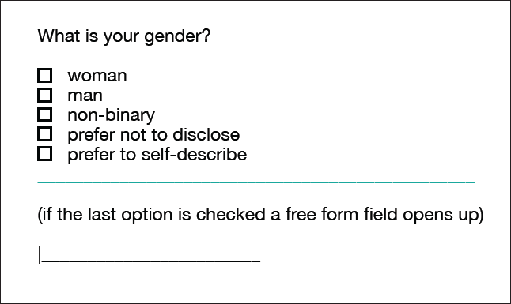

Spiel, Katta, Oliver L. Haimson, and Danielle Lottridge. “How to Do Better with Gender on Surveys: A Guide for HCI Researchers.” Interactions 26, no. 4 (June 26, 2019): 62–65. https://doi.org/10.1145/3338283.

Notes:
- En visualisation d'information, comme en interaction humain-machine, pour réaliser vos projets, vous aurez certainement besoin de mener des enquêtes contextuelles, des évaluations avec des personnes. 
- Si vous avez besoin de collecter des informations sur les genres des personnes avec qui vous réaliserez vos projets, je vous suggère de suivre ces bonnes pratiques issues d'un article de Katta Spiel et collègues, dans ACM Interactions en 2019, dans une démarche d'inclusion et de diversité. 

<!--slide-->

## Genres+Ethnicités &amp; InfoVis: Evaluations

Bradley, Adam, Cayley MacArthur, Mark Hancock, and Sheelagh Carpendale. “Gendered or Neutral? Considering the Language of HCI.” In Graphics Interface Conference, 8, 2015.

Notes:
- Adam Bradley et collègues ont mené une étude sur l'impact des genres de certaines dénominations de personnes en interaction humain-machine. Cette étude a été présentée à la conférence Graphics Interface en 2015, conférence majoritairement canadienne. Les auteurs ont demandé à des participant.e.s à leur étude de dessiner/esquisser des représentations des mots (en anglais, non-genré): user, person, participant, researcher, designer. Figure de gauche. 
- La majorité des participants attribuent le genre masculin aux dénominations proposées.
- Ceci est une autre illustration des biais sur les genres qu'il faut corriger en IHM et InfoVis.
- Ce travail parle aussi de biais sur les ethnicités. Figure de droite en bas. Je vais vous en parler dans les diapositives suivantes.
- Résumé original en anglais: "In this paper, we present a Mechanical Turk study that explores how the most common words that have been used to refer to people in recent HCI literature are received by non-experts. The top five CHI 2014 people words are: user, participant, person, designer, and researcher. We asked participants to think about one of these words for ten seconds and then to draw an image of it. After the drawing was done we asked simple demographic questions about both the participant and the created image. Our results show that while generally our participants did perceive most of these words as predominately male, there were two notable exceptions. Women appear to perceive the terms “person” and “participant” as gender neutral. That is, they were just as likely to draw a person or a participant as male or female. So while these two words are not exactly gender neutral in that men largely perceived them as male, at least women did not appear to feel excluded by these terms. We offer an increased understanding of the perception of HCI’s people words and discuss the challenges this poses to our community in striving toward gender inclusiveness."

<!--section-->

## Communautés &amp; InfoVis

Saffer, Dan. Designing Gestural Interfaces: Touchscreens and Interactive Devices. O’Reilly Media, Inc., 2008.

Notes:
- L'InfoVis s'inscrit dans diverses communautés.
- Ici vous voyez un diagramme de Venn, qui n'est pas basé sur des données, une vue de Dan Saffer, avec "Info Viz" en bas à gauche. 
- Je vais vous illustrer un autre problème d'EDI en InfoVis en passant par une autre communauté: Interaction Design / La Conception d'Interactions.

<!--slide-->

## Populations &amp; InfoVis

Bill Moggridge. “People and Prototypes.” In <a href="https://designinginteractions.com">Designing Interactions.</a> MIT Press, 2007. 

Notes:
- Voici à juste titre "Designing Interactions", un livre de 2007 par Bill Moggridge, co-fondateur d'IDEO, une entreprise de conception de produits et d'interactions mondialement reconnue.

<!--slide-->

## Populations &amp; InfoVis

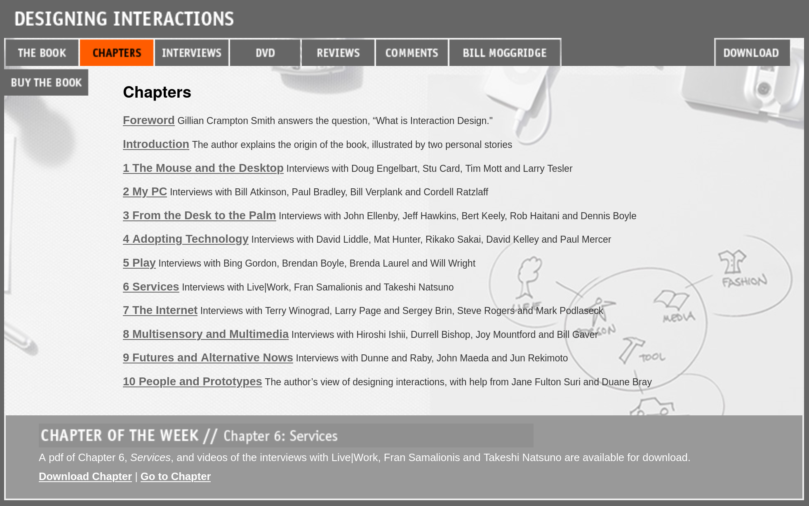

Bill Moggridge. “People and Prototypes.” In <a href="https://designinginteractions.com">Designing Interactions.</a> MIT Press, 2007. 

Notes:
- Ce livre retrace l'histoire de la conception d'interactions à travers 10 chapitres, incluant des entretiens avec des expert.e.s.
- Vous pouvez télécharger le chapitre de la semaine, donc supposé changer hebdomadairement, vous trouverez alors certainement comment accéder à tous les chapitres en analysant l'URL de la semaine.

<!--slide-->

## Populations &amp; InfoVis

Bill Moggridge. “People and Prototypes.” In <a href="https://designinginteractions.com">Designing Interactions.</a> MIT Press, 2007. 

Notes:
- Le dixième et dernier chapitre traite de personnes et prototypes.

<!--slide-->

## Populations &amp; InfoVis

Bill Moggridge. “People and Prototypes.” In <a href="https://designinginteractions.com">Designing Interactions.</a> MIT Press, 2007. 

Notes:
- Je l'ai relu récemment et cette figure m'a sauté aux yeux.
- La légende à droite explique la courbe rouge "en cloche" typique d'une distribution normale et invite à mener des conceptions avec des personnes dans la boucles en échantillonnant des populations représentatives et variées.

<!--slide-->

## Quizz: cette distribution est-elle normale?

Bill Moggridge. “People and Prototypes.” In <a href="https://designinginteractions.com">Designing Interactions.</a> MIT Press, 2007. 

Notes:
- Inspectons cette figure de plus près.
- Je vous propose un troisième quizz: cette distribution est-elle normale?
- On voit un biais: la population représentée est composée essentiellement de personnes blanches.

<!--section-->

## Decoloniser l'InfoVis

As early as 1500 CE, the Incas were using knotted cords, called khipus, <a href="https://aeon.co/ideas/the-khipu-code-the-knotty-mystery-of-the-inkas-3d-records">as a form of data visualization</a>

Wendy Red Star annotated a photo of <a href="http://portlandartmuseum.us/mwebcgi/mweb.exe?request=record;id=71459;type=101">Peelatchiwaaxpáash</a> to highlight the data being encoded all over his hair and regalia. These annotations (a popular tool in data visualization) point out data related to wars that took place in the 1800s.

Stephanie Evergreen, <a href="https://stephanieevergreen.com/decolonizing-data-viz/">Decolonizing Data Viz</a>, 2021.

Notes:
* Stephanie Evergreen, dans son billet très récent de 2021 intitulé <a href="https://stephanieevergreen.com/decolonizing-data-viz/">Decolonizing Data Viz</a>, appelle à décoloniser l'InfoVis.
* Déjà en -1500 (CE/EC) les Incas utilisaient des noeuds sur des cordes pour représenter de données (Figure de gauche).
* L'artiste Wendy Red Star a annoté la photo datant de 1880 en figure de droite pour réveler les données liées aux guerres encodées dans les cheveux et parures de la personne membre de Premières Nations d'Amérique. 
* Pour décoloniser l'InfoVis dès son enseignement, il est important de montrer ces alternatives plus anciennes et plus diverse à la visualisation des données de guerres Napoléoniennes représentées par Minard qui est l'introduction typique en InfoVis.

<!--slide-->

## Florence Nightingale (1820-1910)

Florence Nightingale portrayed in her
early years. (GLC Photo Library).

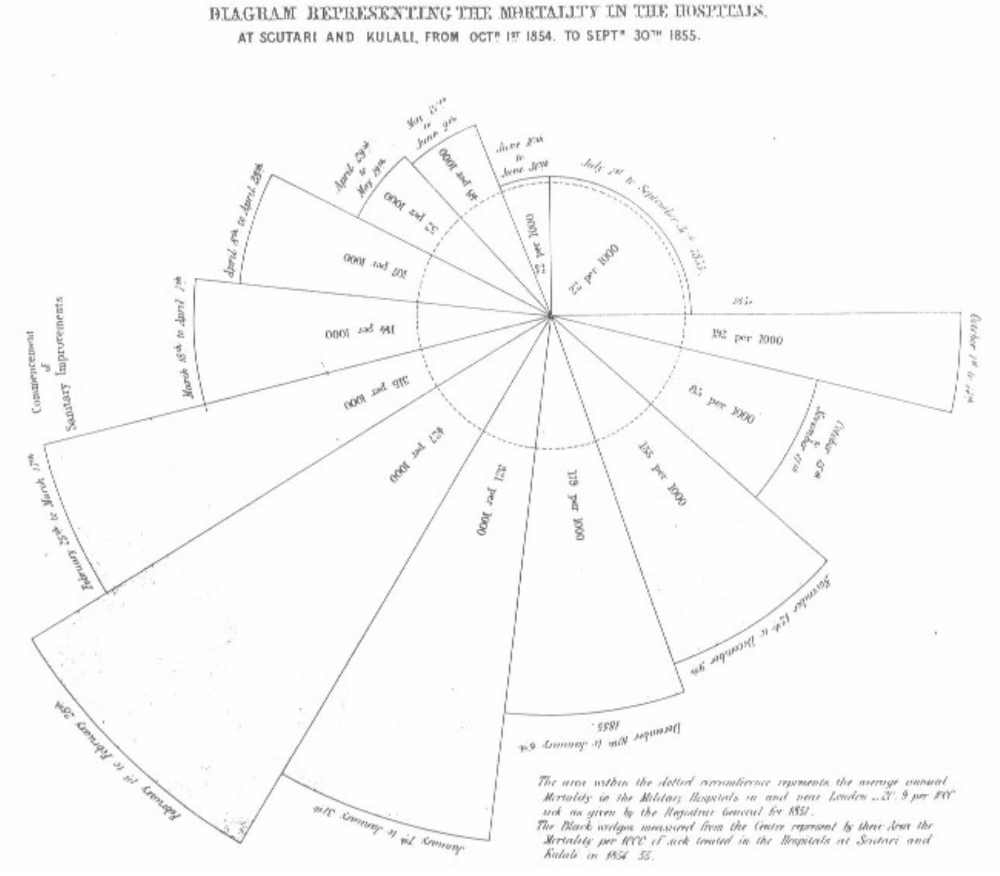

Polar Area Diagrams / coxcombs showing the mortality at the army hospitals at Scutari and Kulali (near
Constantinople) during the Crimean War

Paul J. Lewi. “<a href="http://www.datascope.be/sog/SOG-Chapter5.pdf">Florence Nightingale and Polar Area Diagrams.</a>” In <a href="http://www.datascope.be/sog.htm
">Speaking of Graphics</a>, 2016.

Notes:
- Il aussi important de montrer d'autres "role models" que Jacques Bertin, par exemple Florence Nightingale qui a révolutionné l'InfoVis en créant ce diagramme d'aires polaires.
- "The polar area diagram or 'coxcomb' in Fig. 5.2 shows the mortality in the hospitals at Scutari and Kulali from October 1, 1854, the month of Nightingale's arrival, until September 30, 1855 [8]."
- the “Du Bois Spiral” might be considered equivalent to Florence Nightingale’s “coxcomb” in its historic significance
  https://www.tableau.com/about/blog/2019/2/how-web-du-bois-used-data-visualization-confront-prejudice-early-20th-century
- https://twitter.com/search?src=typd&q=%23VisualizeDiversity

<!--slide-->

## W.E.B. Du Bois (1868-1963)

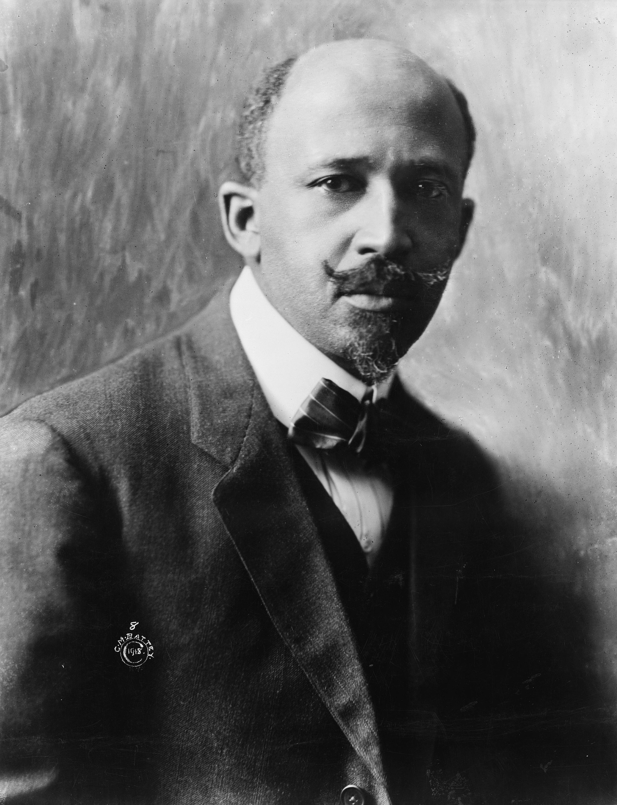

W. E. B. Du Bois in 1918
(<a href="https://en.wikipedia.org/wiki/File:WEB_DuBois_1918.jpg">wikipedia</a>)

    <!-- data-file="images/3rdparty/thinglink/1119380866397634562.html"  -->

InfoVis présentée à l'Exposition Universelle (1900), via <a href="https://www.smithsonianmag.com/history/first-time-together-and-color-book-displays-web-du-bois-visionary-infographics-180970826/">W.E.B. Du Bois’ Visionary Infographics Come Together for the First Time in Full Color</a> By Jackie Mansky, Smithsonian Magazine, 2018

Notes:
- Egalement W.E.B du Bois.
- W.E.B. = William Edward Burghardt Du Bois
- En 1895, il devint le premier afro-américain à obtenir un doctorat en philosophie de l'université Harvard https://fr.wikipedia.org/wiki/W._E._B._Du_Bois
- in 1895 he was the first African American to earn a Ph.D. from Harvard University https://en.wikipedia.org/wiki/W._E._B._Du_Bois
- A droite vous pouvez explorer une des visualisations de W.E.B. du Bois exposée à l'Exposition Universelle en 1900, en deux langues. 

<!--section-->

## Promouvoir vos travaux

Catherine D’Ignazio and Lauren F. Klein. “7. Show Your Work.” In Data Feminism. The MIT Press, 2020. https://data-feminism.mitpress.mit.edu/pub/0vgzaln4.

Notes:
- Vous serez amené.e.s à promouvoir vos travaux en InfoVis. 
- Dans le chapitre 7 du livre Data Feminism, Catherine D’Ignazio and Lauren F. Klein nous rappelle l'important de faire attribution à toutes les personnes ayant participé à la réalisation de project en sciences ou visualisation des données.

<!--slide-->

<!-- Use this to add a background image: -->
<!-- .slide: class="cover" data-background="images/projects/InfoPhys.jpg" -->

<!-- ## InfoPhys -->

Notes:
- Je vais prendre en exemple un de mes travaux que j'ai choisi comme couverture de cette présentation.
- Je vous avais déjà expliqué que cette image illustrait des problèmes d'EDI en InfoVis au début de cette présentation. 

<!--slide-->

<!-- ## InfoPhys  -->
## Promouvoir vos travaux

Poster

Paper

Frisson, Christian, and Bruno Dumas. “<a href="https://doi.org/10.1145/2839462.2856545">InfoPhys: Direct Manipulation of Information Visualisation Through a Force-Feedback Pointing Device.</a>” In Proceedings of the TEI ’16: Tenth International Conference on Tangible, Embedded, and Embodied Interaction. TEI ’16. ACM, 2016.

Notes:
* Pour ce travail présenté à la conférence TEI, nous avons proposé une visualisation des tendances de recherche dans les 10 premières éditions des conférences TEI. Nous avons utilisé l'outil de gestion de bibliographies Zotero et le composant Paper Machines d'analyse et visualisation de données textuelles.
* Je veux donc promouvoir les travaux de personnes tierces qui ont été indispensables à la réalisation de ce projet.
* Dans les articles scientifiques, nous faisons attribution en citant des références, et dans les remerciements.

<!--slide-->

## Cora Johnson-Roberson

Cora Johnson-Roberson's Portrait from <a href="https://github.com/corajr">https://github.com/corajr</a>

<a href="http://papermachines.org/acknowledgments-and-funding/">PaperMachines Acknowledgements and Funding</a>

Notes: 
* Sans les travaux de Cora Johnson-Roberson qui a crée le composant Zotero Paper Machines, nous n'aurions jamais réussi à réaliser ce projet.

<!--slide-->

<!-- Use this to add a background image: -->
<!-- .slide: class="cover" data-background="images/projects/InfoPhys.jpg" -->

<!-- ## InfoPhys -->

Notes:
* Une autre contribution de ce projet qui justifie son illustration dans cette présentation est que nous avons voulu rendre cette visualisation d'information accessible par le sens du toucher, par l'haptique, à travers ce pointeur/manipulateur à retour d'effort embarqué sur lequel la visualisation d'informations est projetée.

<!--slide-->

## Accessibilité &amp; Haptique

<!--  -->

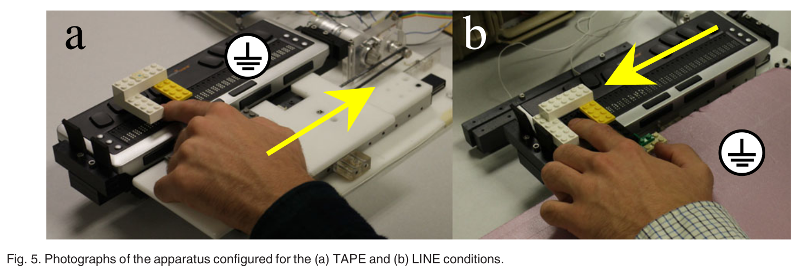

Russomanno, A., S. O’Modhrain, R. B. Gillespie, and M. W. M. Rodger. “Refreshing Refreshable Braille Displays.” IEEE Transactions on Haptics 8, no. 3 (July 2015): 287–97. https://doi.org/10.1109/TOH.2015.2423492.

Notes: 
* Voici un travail de Russomanno et collègues qui ont étudié quel type de retour haptique favorise l'accessibilité.
* Deux types de retour de stimulation de textures haptiques sur le doigt font partie des conditions expérimentales: 1) le doigt déplaçant avec lui une cellule d'affichage de textures tactiles, comme une main déplacerait une souris (Figure en haut à gauche) et comme pour le projet que je viens de vous présenter, ou l'inverse 2) le doigt glissant sur une ligne de cellules d'affichages de texture tactiles, comme pour la lecture de code Braille.
* S'inspirer de l'interaction avec une souris pour ajouter un retour haptique de textures sur une visualisation d'informations n'est alors pas la technique idéale.  
* La Figure en haut à droite montre le taux d'erreurs pour des tâches effectuées dans ces 2 conditions.  
* La seconde auteure, Sile O'Modhrain, qui souffre de déficiences visuelles, a montré leurs travaux dans sa présentation pour le tutoriel sur l'haptique pour la conférence IROS 2020 (https://iros-haptics-tutorial.org/), où elle déplore que les chercheurs en haptique répetent ce genre d'erreurs au lieu de vérifier l'état de l'art.
* Il faut donc améliorer l'interdisciplinarité entre les diverses communautés autour de l'IHM et l'InfoVis pour mieux inclure les diverses populations qui pourraient bénéficier des visualisations ou affichages d'information. 

<!--slide-->

## Accessibilité &amp; InfoVis

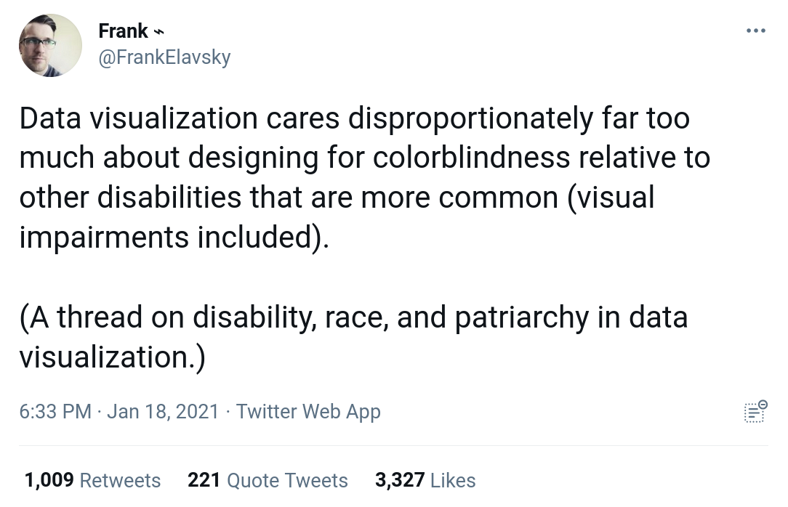

https://twitter.com/FrankElavsky/status/1351311898428362754

Notes:
* Ce tweet de Frank Elavsky révèle un biais. Les travaux d'accesibilité en InfoVis se sont surtout concentrés sur le choix des couleurs pour les personnes souffrant de dyschromatopsie ou daltonisme.
* Or il s'avère que les personnes souffrant de dyschromatopsie sont en majorité des hommes blancs! 

<!--slide-->

## Accessibilité &amp; IHM

Oana Mangiurea, <a href="https://fosdem.org/2021/schedule/event/latest_tech_great_accessibility_not_so_much/">Latest tech, great! Accessibility, not so much.</a>, FOSDEM 2021

Notes: 
* Pourtant 15% de la population mondiale, soit 1 milliard de personnes souffrent d'handicaps, et dont 10% sont visuels.
* Voici une capture d'une présentation d'Oana Mangiurea, au Free and Open source Software Developers' European Meeting (FOSDEM), dans la session Open Source Design.

<!--slide-->

## Accessibilité &amp; Web

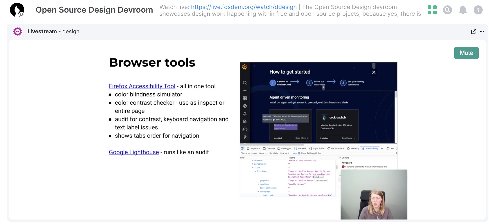

Oana Mangiurea, <a href="https://fosdem.org/2021/schedule/event/latest_tech_great_accessibility_not_so_much/">Latest tech, great! Accessibility, not so much.</a>, FOSDEM 2021

Notes:
* Oana Mangiurea nous montre ici des exemples d'outils pour vérifier l'accessibilité d'applications web, donc aussi utiles pour des visualisations d'information.

<!--slide-->

## Accessibilité &amp; Web

Oana Mangiurea, <a href="https://fosdem.org/2021/schedule/event/latest_tech_great_accessibility_not_so_much/">Latest tech, great! Accessibility, not so much.</a>, FOSDEM 2021

Notes:
* Et dont des outils spécifiques pour la dyschromatopsie.

<!--section-->

## Sommaire

### EDI?

### EDI &rarr; InfoVis

## InfoVis &rarr; EDI

Notes:
- Je vais maintenant conclure sur comment la Visualisation d'Information peut aider à améliorer l'Équité, la Diversité et l'Inclusion.

<!--slide-->

## InfoVis &rarr; EDI

Gaither, K. “<a href="https://doi.org/10.1109/MCG.2017.3621230">How Visualization Can Foster Diversity and Inclusion in Next-Generation Science.</a>” IEEE Computer Graphics and Applications 37, no. 5 (2017): 106–12

Notes:
- Voici une figure d'un article dont le titre illustre bien cette conclusion, qui montre comment les outils ou techniques employés en InfoVis (losanges au centre) peuvent s'intégrer dans diverses pratiques (disques en périphérie).
- Je voudrais passer un message essentiel: faites usage de vos capacités d'analyse visuelle et de données que vous avez entraînées en apprenant la visualisation d'information, pour prendre le temps de mieux comprendre les sujets sensibles d'actualité avant de juger trop vite, pour compenser cette immédiateté ce que les réseaux sociaux nous imposent.

<!--slide-->

## InfoVis &rarr; Autonomisation &amp; Inclusion

IEEE VIS 2020 Capstone by Sheelagh Carpendale: Data VIS for Empowerment and Inclusion

https://www.youtube.com/watch?v=XQhBHnPIsRk

Notes:
* Je vous propose de consulter en différé la présentation de clôture (capstone) de la conférence VIS 2020 par Sheelagh Carpendale qui illustre ses travaux en InfoVis pour l'autonomisation et l'inclusion.

<!--slide-->

## Xenographics

https://xeno.graphics/about/

Notes:
* Voici XenoGraphics de Maarten Lambrechts qui recense une collection de visualisations d'informations non usuelles, parfois chimériques. 
* Dans l'à propos, le but de XenoGraphics est de combattre la xenographophobie. La xenophobie est la peur d'autrui, des personnes différentes, provenant de diverses cultures. 

<!--slide-->

## Xenographics

https://xeno.graphics/

Notes:
* Voici quelques exemples de Xenographes pour illustrer la diversité en InfoVis, pour célébrer l'Équité, la Diversité et l'Inclusion. 

<!--section-->

## Annonces

<!--slide-->

## Rejoignez les communautés Slack en IHM/InfoVis

Canada HCI https://canadahci.slack.com

EarlyCareerVisResearcher https://earlycareersinvis.slack.com/

<!--slide-->

## Observez les résultats du concours Observable Black History Month DataViz

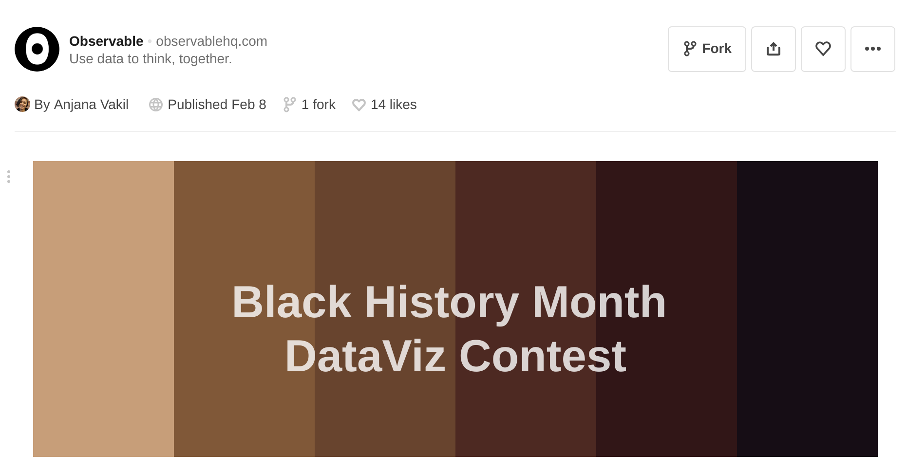

https://observablehq.com/@observablehq/black-history-month-dataviz-contest

Notes:
* Résultats le 25 février ("aujourd'hui").

<!--slide-->

## Participez au test d'utilisabilité Idyll

https://twitter.com/idyll_lang/status/1359955913197588482

<!-- https://docs.google.com/forms/d/e/1FAIpQLScZIGzKtd_IL6tK-fAGEr76VgNDCQjBW3l3JHYLz0JES7JZ3A/viewform?usp=send_form -->

Notes:
* The Idyll team is looking for people who would be willing to test new tools for authoring interactive documents!

<!--slide-->

## Participez au concours en haptique &amp; audio

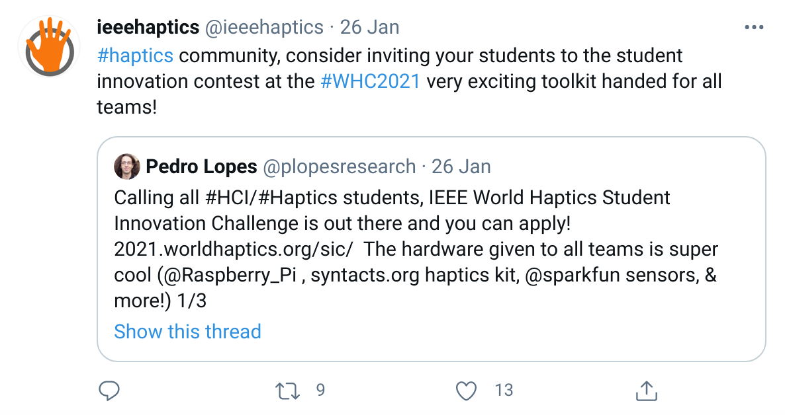

https://twitter.com/ieeehaptics/status/1354149086061072385

Date limite pour les propositions: 5 mars 2021

https://2021.worldhaptics.org/sic/
